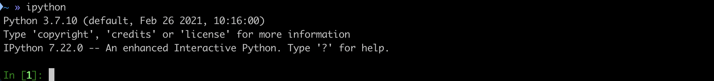
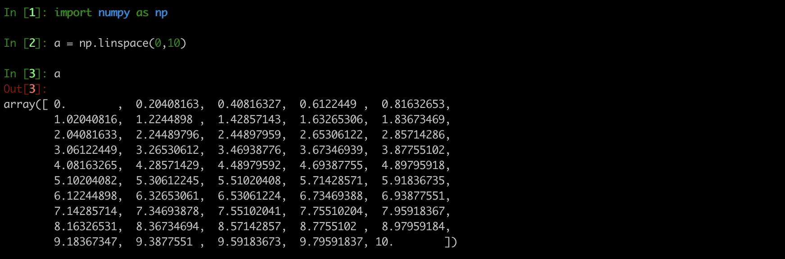
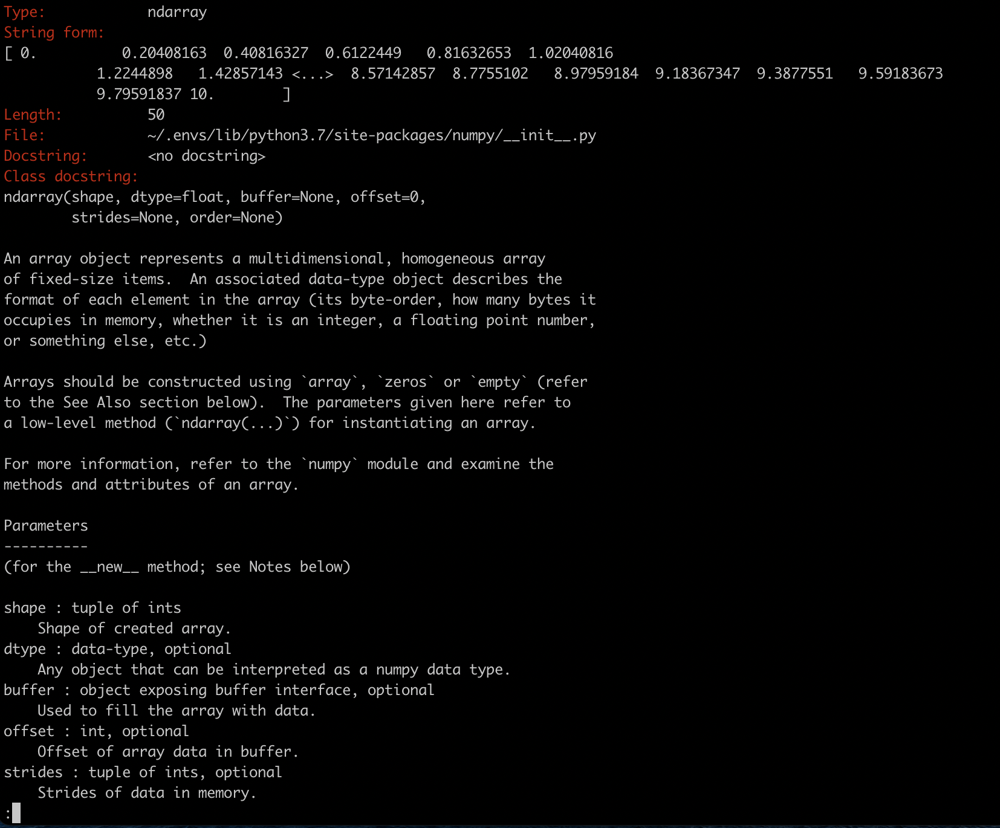
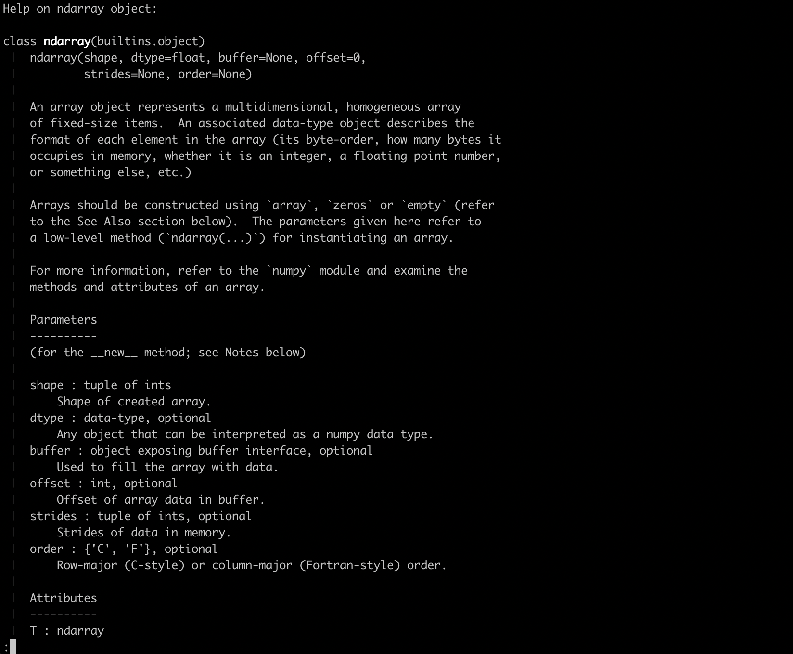
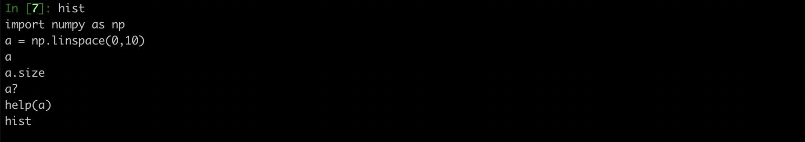

# iPython
---------

ipython is the better way to interactively run python on a shell. To start, you sinply do 

    ipython

If you have correctly installed anaconda, this will launch ipython on your command line. 
If you're in an environment and haven't added ipyhton to tht environment, you can do so by 

    conda install ipython
    
Try the command again, it should work. 
This is roughly what it should look like if you've succeeded: 

    
Let's try a few commands now

    import numpy as np
    a = np.linspace(0,10)
    a
    

    
The last command should print out what a looks like. This is one feature that makes ipython incredibly useful - 
**you can quickly check the contents of your variables at various stages of manipulation.**

Next, let's try typing just the following and hitting tab

    a.si
    
This should autocomplete the command to 

    a.size

because `a` is now defined to be a numpy array. 

So here's the second super useful feature of ipython - 
**your commands autocomplete with tabs**. 

You can try the same thing with the following, and tab through the resulting options till you find what you want

    np.lo
    a.
    
So ipython really doesn't need much info from you to start prompting options. 
It works better if you have a vague idea of what you want. For example doing 

    np.
    
and hitting tab will be really unhelpful. 

Another great feature in ipyhton is the `?` command. Doing

    a?
    
gives you info on the variable `a` - it tells you its parameters and attributes. 
Hit `q` to quit. 

If you have a variable and you forget what's stored in it, doing `var?` is a useful reminder. 
You can also of course print it like we did above by simply demanding `var`. 
So **ipython tells you about your defined variables**. 

But you can get a lot more than that. What if I not only what to know about the variables I've deifned, 
but also how I can manipulate these variables? What are all the functions I can perform on this variable class?
You simply do 

    help(a)
    

This prints some of the same info as `a?` but also a long, exhaustive list of functions you can perform on `a`. 
So **ipython tells you all the things your variable class can do**.

There are several other incredibly useful ipython features. I'll leave you to discover them. But I'll end with one more. 
Let's say you tested out a lot of code in ipython, found something that works well for you and now you want to take that 
snippet of code and add it to your larger programme (or maybe it's just me who uses ipython like that). 

Instead of scrolling through the tonnes of things you tried, copying the exact correct indentations etc for those lines, 
ipython has you covered. Try 

    hist

This prints out every command you gave ipython so far in this shell. 
So **ipython stores your commands per shell instance for easy retrieval**. 

Finally, exit by hitting Ctrl+z or

    exit

It's okay. ipython will be there for you when you come back. 

