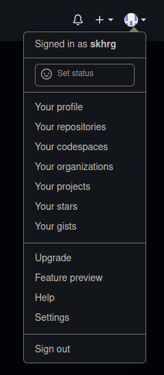
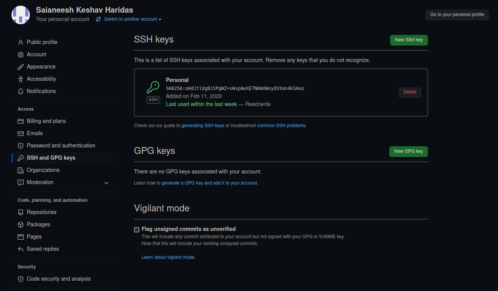
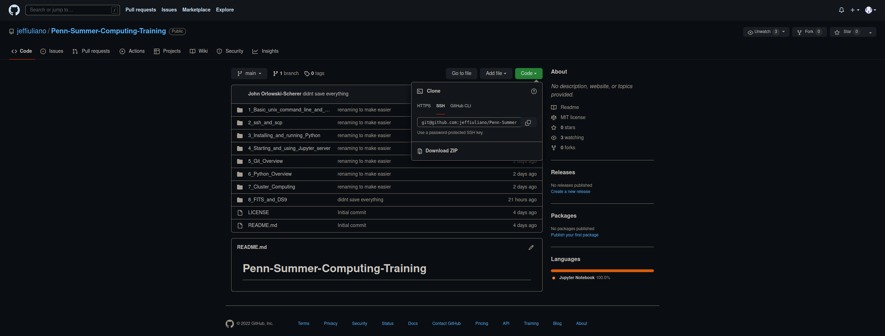
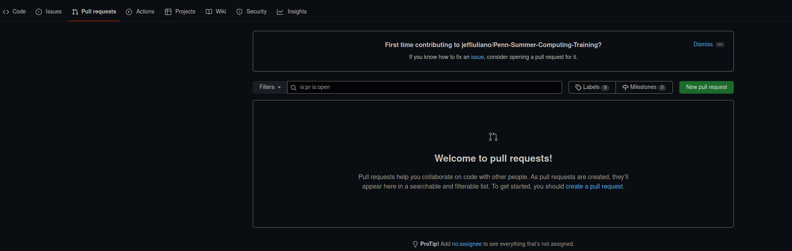

# Git

## What is Git

Git is a version control system widely used by programmers.
Version control software's primary function is to track the revision history of files, a codebase being tracked by git is referred to as a git repository.
Git also is incredibly useful as a collaborative tool, allowing multiple people to work on the same codebase.
To this end git includes a number of tools for dealing with conflicting edits to code.

## GitHub

Git uses a form of version control called distributed version control, this means that there is no central server acting as a master copy of the codebase.
However, it is still useful to have a common server host a copy of the git repository, this way changes made in each developers local copy can be put somewhere where other users can access them.
Git has tools to send and receive changes to and from a remote repository which we will cover later.
While you can host this remote copy on your own server, it is convenient to use services such as GitHub which will host a copy of your repository and also includes useful collaborative tools.

### Setting Up GitHub

If you already have a GitHub account with keys setup you can skip this.

1. Go to [github.com](github.com)
2. Create an account if you don't have one, if you already have one log in.
3. Click on the icon in the upper right corner and click "Settings"

4. Click "SSH and GPG Keys"
5. Click "New SSH Key"


6. Copy and paste your public key into the box that says "Key". If you want you can generate a new key for this, just make sure it is somewhere that SSH knows to find it.

## Basic Git

### Creating a Repository
To create a repository simply go to GitHub and hit the "New" button on the left. Then just follow the prompts, all of this can be changed later so don't worry too much about it.

You can also create a repository manually, but if the repository is going on GitHub anyways it is simpler to just create it on GitHub.

### Cloning
To get a local copy of a git repository you use an operation called cloning.
To do this you first need the path to a remote copy of the repository.
If the repository is on GitHub go to its GitHub page and click the "Code" button.

There will be four options:

* HTTPS: this will allow you to clone the repository but you won't be apply to send your changes back to GitHub.
* SSH: this will allow you to clone the repository with the ability withou the restrictions of the HTTPS method.
* GitHub CLI: this will work similarly to the SSH method but most computers will not have the GitHub CLI installed.
* Download ZIP: this will download a copy of the code but it won't be a git repository.


In general you will want to use the SSH method, although the HTTPS method is useful if you need a read only copy on a computer where you don't have keys setup.

To clone a repository follow these steps:

1. Copy the URL that GitHub provides when you click SSH or HTTPS.
2. Open a terminal on the computer where you want the repository to live.
3. Navigate to the directory where you want the repository to live.
4. Execute the following command `git clone URL` where `URL` is what you copied in step 1.

So to clone this repository the command would be:

```
git clone git@github.com:jeffiuliano/Penn-Summer-Computing-Training.git
```

### Staging Changes
Once you have the repository cloned you can enter it and start coding.

The `add` command lets git know that you want it to index the changes you have made to files or directories, this is called staging your changes. The general syntax is `git add PATH0 PATH1...`.

So if you just edited a file called `hello_world.py` you would type

```
git add hello_world.py
```

to let git know that you want it to index your changes.

If you want to `add` all files that you have edited then you can use `git add --all`.
You may sometimes see people running `git add *` instead of `--all`, while this will usually work the same it can try to `add` files that git should be ignoring and should not be used.

If you accidentally `add` a file you didn't mean to you can run `git restore --staged PATH` where `PATH` is the path to the file to un-`add` it.
Be careful when doing this, if you forget `--staged` then you will lose your changes.

### Committing Changes
Once you have made your changes and staged them you can now `commit` them.
Each commit is a saved point in the version history in your codebase that you can revert to.
In general you want to commit frequently enough to track changes that people will actually care about, but not so frequently as to make to commit history messy and hard to follow.

To commit your changes the command is `git commit`. After executing this a text editor will appear allowing you to enter a commit message.
The commit message should be a short description of changes made.
Sometimes you may need to write a long commit message with more details, in this case make sure the first line contains a quick summary so people can still know what its about at a glance.

When writing a short commit message it is usually faster to bypass opening a text editor by committing with `git commit -m "MESSAGE"` where `MESSAGE` is your commit message.

If you need to edit your last commit you can use `git commit --amend`.
If you make changes to files and `add` them then `git commit --amend` will include these changes in the commit.

### Pushing and Pulling
To send your commits to the remote repository simply run `git push`.

The first time you `push` git may ask you to run it with specific flags set, just follow the prompts.

Note that only committed changes will be sent to the remote repository when you `push`.

If someone has pushed changes to the remote repository you will have to apply them to your local copy before pushing.

To do this simply run `git pull`.

If you have made edits locally, git will try to deal with conflicts for you.
It has three primary ways of doing this:

* Merging: git will treat your code and the code in the remote repository as divergent branches and try to combine the changes. In general this will work fine unless you have made changes to the same part of the code as someone else, in which case git will have you manually resolve the conflicts.
* Rebase: git will try to apply your local changes on top of the remote changes.
* Fast-forward: git will apply the latest changes, if your commit history has diverged from the remote history this will fail.

In general I recommend rebasing when the remote changes are on files you haven't locally edited.
You can tell git to do this by calling `git pull --rebase`.

If the changes are on shared files I recommend merging.
This is the default behavior of `push`.

### Resolving Merge Conflicts
Sometimes git will fail to merge properly and ask you to resolve the conflicts manually.
To deal with this open the file (or files) that git says has a conflict and look for something like this:

```
<<<<<<< HEAD
SOME CODE
=======
YOUR CODE
>>>>>>> YOUR_BRANCH
```

The `<<<<<<<` represents the start of the conflict and `>>>>>>>` the end.

`=======` separates the conflicting code.

The text next to `<<<<<<<` and `>>>>>>>` refers to where each piece of code came from.
Typically the code you are trying to merge in will come second.

To resolve the conflict replace that entire block with whatever code you want to end up in the repository.
In simple cases this will often just involve picking one chunk of code and deleting the other, but sometimes it can be more involved.

After resolving all the conflicts you will need to `add` and `commit` the files before proceeding.

Note that merge conflicts are a common source of bugs, so always double check your resolution.

If you find yourself dealing with complex merge conflicts I recommend changing the conflict style to `diff3`.
See this [StackOverflow Post](https://stackoverflow.com/questions/457927/git-workflow-and-rebase-vs-merge-questions/11219380#11219380) for details (as well as some other useful information on dealing with conflicts).

### Other Essential Tools
`git status`: This allows you too see what files you have edited but not staged yet, which files you have staged but not committed, how many commits you haven't pushed, what branch you are on, and other bits of useful information.

`git log`: This lets you read the commit history of your repo. The format is as follows:

```
commit COMMIT_SHA
Author: AUTHOR_NAME <AUTHOR_EMAIL>
Date:   COMMIT_DATE COMMIT_TIME COMMIT_TZ

    COMMIT_MESSAGE
```

`git diff PATH`: This allows you to see the difference between your current version of a file and what is currently committed for that file, where `PATH` is the path to the file.

## Undoing Changes
Since git is version control software, one of its useful features is to revert code to a previous state.
This is often useful when something is broken and you want to go back to a state that is working.

### Changes that haven't been committed
Changes that are not committed can be undone with the `restore` command.

The syntax is `git restore PATH` where path is the path to the files whose changes you want to undo.

For example to undo changes to `hello_world.py`: `git restore hello_world.py`.

To undo all changes in the current directory: `git restore .`

`restore` is an action that cannot be undone, so be very careful when using it.

### Changes that have been committed
To undo committed changes we use the `reset` command.

The syntax is `git reset COMMIT_SHA` where `COMMIT_SHA` is the SHA hash used to identify the commit you want to go back to.
To get this hash use `git log`.

By default `reset` just removes the commits but leaves your files untouched.
If you want it to also remove the changes to your files use `git reset --hard COMMIT_SHA`.

If you mistakenly `reset` you are able to undo it.
To do so first run `git reflog`, this is similar to `git log` but it shows changes to the repository state from things like `reset`.
See [this documentation](https://git-scm.com/docs/git-reflog) if you want to learn more.

From `reflog` grab the SHA hash referring to your erroneous `reset`, the commit message should start with `reset:`.

If you want to completely undo your reset then use `git reset --hard COMMIT_SHA` where `COMMIT_SHA` is the one you got from `reflog`.

If you just want to restore specific files use `git checkout COMMIT_SHA -- PATH` where `PATH` is the path to the files you want to restore.


### Undoing Pushed commits
If you pushed before `reset` and then when pushing this new commit history you will have to use `git push -f` where the `-f` tells git to force push and overwrite the remote history.
This can be risky so try to avoid this scenario.

A safer way of dealing with pushed commits is instead to use `git revert COMMIT_SHA` instead of `reset`.
Unlike `reset` it doesn't remove commits, instead it creates a new commit that undoes the changes to your files.

## Branches and Forks

When working on a repository with other people it is often useful to keep your own active development separate from other's.
To do this there are two primary methods: branching and forking.

### Branching
A branch is an offshoot of a repository's commit history where you can develop without touching the main/master branch.
It contains all of the previous history of the repository and can be merged back in when you are done developing on it.
If you are working on a large repo with other people it is good practice to create a branch for any non trivial changes you make to the code.

To create a branch run `git branch BRANCH_NAME`.

To switch to it run `git checkout BRANCH_NAME`.

To switch back to the main branch run `git checkout main` or `git checkout master`, this will depend on how old the repository is.

To check what branch you are currently on run `git status`.

Make sure that you are on the branch you want to be on when you commit.

If you find yourself developing on the same branch for a while it is a good idea to periodically merge in changes from the main branch.
To do this run:

```
git fetch
git checkout BRANCH_NAME
git merge master
```

Once you are done developing you can merge your commits into the main branch.
To do this run:

```
git checkout master
git pull
git merge BRANCH_NAME
```

### Forking
A fork is similar to a branch but it creates a whole new repository.
This is useful in two scenarios:

1. You don't have permission to create branches on the original repository.
2. You want to create a new piece of software using some existing code as your starting point.

To create a fork on GitHub go to the repository you want to fork and press the "Fork" button on the upper right.


Once the fork is made you can clone this new repository.

To merge changes from the original repository to you can open your fork in GitHub and click the "Fetch upstream" button.

Alternatively, if you will be actively using this fork for a while you can set your fork up to be able to pull from the original repository.
To do this go run `git remote add upstream ORIGINAL_PATH`, where `ORIGINAL_PATH` is the URL (SSH or HTTPS) of the original repository.

Then to merge in changes from to original to your fork run:

```
git fetch upstream
git checkout master
git merge upstream/master
```

### Pull Requests
To merge your fork into the original repository you will typically have to open what is called a "Pull Request" or PR for short.
A PR allows the owner of the original repository to review your commits and request changes before approving the code to be merged in.
You can also open a PR for your branches, and it is good practice to do so for complex changes so that others can look over your code before it gets merged in.

To open a PR go to the repository that you want to merge your code into and click "Pull requests", then press "New pull request".



After that select your fork/branch that you want to PR.
To show forks you will have to press the button that says "compare across forks"


The code you want to merge in is in the "head repository" in the "compare" branch.

Your PR should include information about the code you are committing to help whoever is reviewing it.
Some repositories may have specific information that they want you to include in your PR or particular formatting for the PR.

## Other Useful Things

### gitignore
Sometimes you may want git to ignore certain files such as compiled code, data files, etc.
To do this simply create a file in the root of your git repository called `.gitignore`.
Any patterns contained in this file will be ignored by git, these can be specific file/folder paths or more generic patterns with wildcards.

For example if my `.gitignore` contains the following:

```
./data
*.o
```

git will ignore the `data` folder as well as any files with the `.o` extension.

If git is already aware of a file, simply adding it to your `.gitignore` won't make it ignore it.
First you need to tell git to forget about it by running `git rm --cached PATH`, where `PATH` is the path to the file.

Be careful when doing this, if you omit the `--cached` flag the file will be deleted.

If you want git to start tracking a file that your `.gitignore` tells it to ignore you can force add it with `git add -f PATH`, where `PATH` is the path to the file you want to track.


### Issues
GitHub includes a feature where users can raise issues on a repository.
This can be a great way to track down weird bugs or put in feature requests.

It also can be useful if you are looking for some code to contribute, you can assign an issue to yourself and put in a PR that closes it.

### Markdown and README
GitHub can render a number of different file types for viewing.
One particularly useful one is markdown files (like this one), since markdown is readable both as plain text and when rendered.
This makes it useful for writing documentation and instructions since it can quickly be referenced in a text editor.

Typically, many repositories will include a file called a README with key information such as a description of the repository and installation instructions.
If you write a README in markdown and title it `README.md` GitHub will automatically render it when you go to the repository.

A useful reference for writing markdown can be found [here](https://github.com/adam-p/markdown-here/wiki/Markdown-Cheatsheet)
